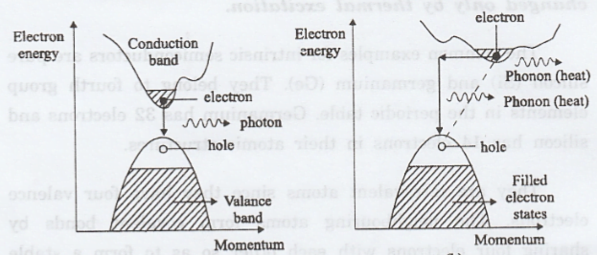

In crystalline solids, the motion of charge carriers can be conveniently described using the relationship between their **energy (E)** and **wavevector (k)**, commonly depicted in the **E–k diagram**.  
This approach helps determine important physical parameters such as **group velocity**, **momentum**, **effective mass**, and the **energy band gap**, all of which are crucial in semiconductor physics.

**Pre-text (room temperature bandgaps):** At 300 K the approximate bandgap energies are: Silicon (Si) — 1.12 eV (indirect), Gallium Arsenide (GaAs) — 1.42 eV (direct), and Germanium (Ge) — 0.66 eV (indirect). Germanium therefore has the smallest bandgap at room temperature.

---

## **Group Velocity and Momentum from the E–k Diagram**

**Group velocity** is the velocity of a wave packet. A wave packet is a linear combination of constant energy (E) wave function solutions around energy E with unity probability of finding the particle in the packet.

The **group velocity** of an electron wave packet in a crystal is obtained from the slope of the **E–k** curve:

$$
v_g = \frac{1}{\hbar} \frac{dE}{dk}
$$

Where:

- $v_g$ → Group velocity  
- $\hbar$ → Reduced Planck's constant  
- $\frac{dE}{dk}$ → Slope of the **E–k** curve

**Interpretation of the slope:**

- A **steep slope** ⇒ **high group velocity**
- A **flat slope** ⇒ **low or zero group velocity** (e.g., at the top of the valence band or bottom of the conduction band)

The **crystal momentum** ($p$ is momentum of carrier in the crystal) is related to the wavevector $k$ by:

$$
p = \hbar k
$$

**Conduction:**

- Electrons occupy states in the **conduction band** above the bandgap.
- Holes correspond to **unoccupied states** in the **valence band**.
- Near the **band extrema**, the curvature of the **E–k** plot is directly linked to the **effective mass** of carriers.

Diagram showing E-k diagram with conduction band (CB), valence band (VB), and bandgap (BG)
 

---

## **Effective Mass**

The **effective mass** ($m^*$) is the electron mass incorporating the effect of the crystal lattice. It characterizes how an electron responds to an **external force** inside a crystal lattice.  
It is derived from the **curvature** of the **E–k** relation:

$$
m^* = \hbar^2 \left( \frac{d^2E}{dk^2} \right)^{-1}
$$

> Inverse curvature → lighter effective mass  
> Higher curvature → easier acceleration

**Physical interpretations:**

- **Large curvature** (sharp bending) → **small $m^*$** → carriers **accelerate easily**.
- **Small curvature** (flatter band) → **large $m^*$** → carriers **respond sluggishly**.

In three dimensions, the acceleration of a carrier under an applied force $F$ is:

$$
\frac{dv}{dt} = \frac{1}{m^*} \cdot F
$$

 

---

## **Band Gap Energy**

The **band gap energy** ($E_g$) is the energy difference between the **conduction band minimum (CBM)** and the **valence band maximum (VBM)**:

$$
E_g = E_c - E_v
$$

Where:

- $E_c$ → Conduction band edge energy  
- $E_v$ → Valence band edge energy  

**Types of band gaps:**

- **Direct bandgap:**  
  - CBM and VBM occur at the **same** $k$-value.  
  - **Direct band transitions:** Only $\Delta E$ (photon emission) changes during transitions.
  - Allows **efficient optical transitions**.
  
- **Indirect bandgap:**  
  - CBM and VBM occur at **different** $k$-values.  
  - **Indirect band transitions:** Both $\Delta E$ (photon) and $\Delta p$ (momentum) change during transitions.
  - Requires **phonon assistance** for **momentum conservation** ($\Delta p$).

Diagrams showing direct band transitions (left) with only photon emission, and indirect band transitions (right) requiring phonon assistance for momentum conservation. (If this image is from an external source, please add appropriate reference.)
 

---
